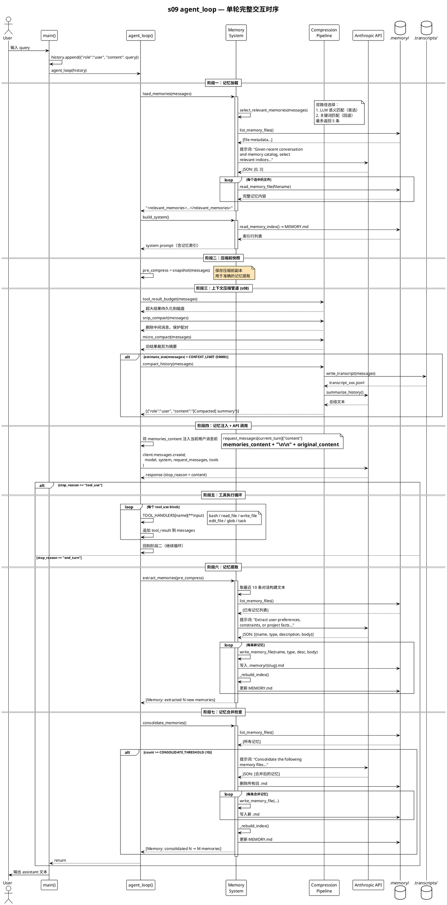
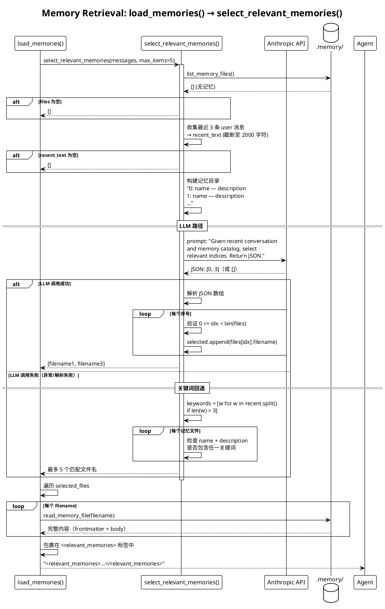
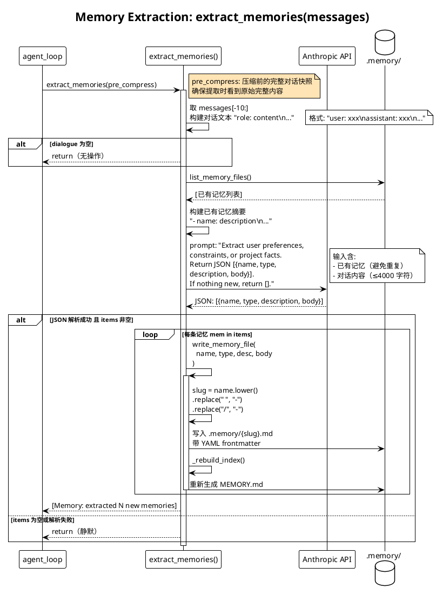
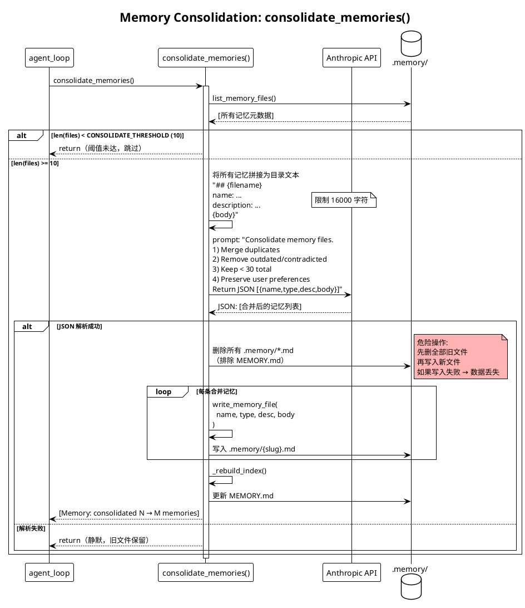
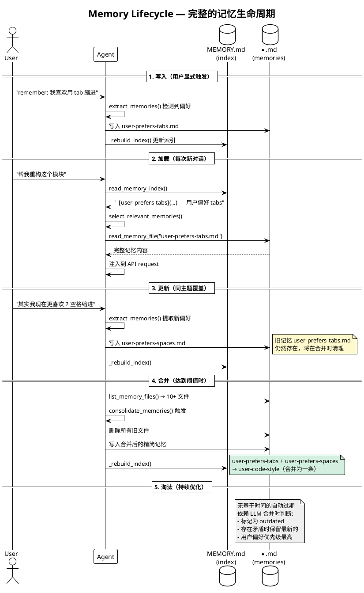
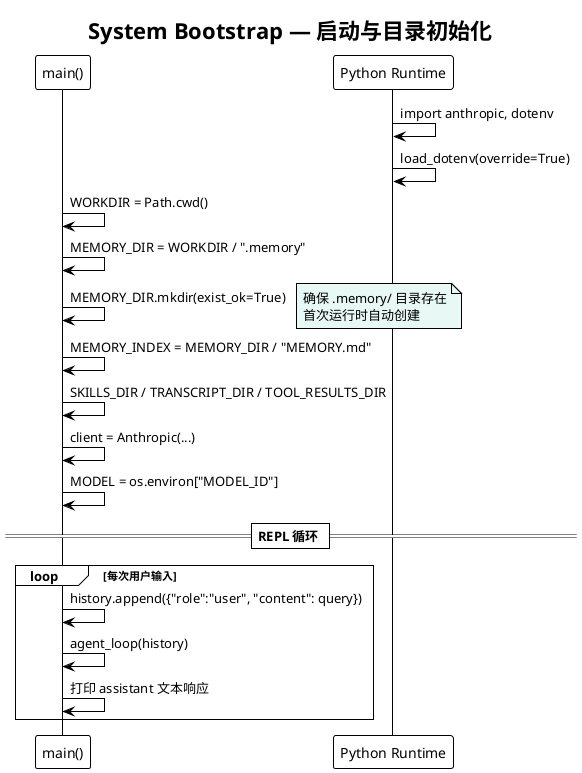

# s09_memory/code.py — 代码逻辑分析

## 1. 概述

`code.py` 是 s09 模块的核心实现，为编码 Agent 提供**跨会话持久化记忆系统**。它在 s08（上下文压缩）的基础上新增了记忆的**存储、检索、提取、合并**能力，使 Agent 能够在多次对话中积累和复用知识。

---

## 2. 整体架构

```
┌─────────────────────────────────────────────────────────┐
│                    agent_loop (主循环)                     │
│                                                         │
│  1. load_memories()     ← 注入相关记忆到当前对话             │
│  2. build_system()      ← 构建包含记忆索引的 system prompt  │
│  3. 压缩管道 (s08)       ← budget → snip → micro          │
│  4. API 调用 + 工具执行   ← 标准 ReAct 循环                  │
│  5. extract_memories()  ← 从对话中提取新记忆                 │
│  6. consolidate_memories() ← 定期合并                       │
└─────────────────────────────────────────────────────────┘
```

---

## 3. 存储结构

### 3.1 文件布局

```
.memory/
  MEMORY.md          ← 索引文件（每行一条记忆，≤200 行）
  *.md               ← 独立记忆文件（Markdown + YAML frontmatter）
```

### 3.2 记忆文件格式

每个记忆文件包含 YAML frontmatter：

```yaml
---
name:        # 记忆名称
description: # 一行摘要，用于索引查找
type:        # user | feedback | project | reference
---
# 正文内容（Markdown）
```

### 3.3 四种记忆类型

| 类型 | 含义 | 示例 |
|------|------|------|
| `user` | 用户偏好/身份 | 用户喜欢用 tab 缩进 |
| `feedback` | 用户反馈/指导 | "每次修改前先读文件" |
| `project` | 项目事实/约束 | 项目使用 Python 3.10+ |
| `reference` | 外部资源指针 | API 文档 URL、看板链接 |

---

## 4. 核心函数详解

### 4.1 存储层 — CRUD 操作

#### `_parse_frontmatter(text: str) -> tuple[dict, str]`

解析 YAML frontmatter。通过 `---` 分隔符识别 frontmatter 块，解析 `key: value` 行提取元数据，返回 `(metadata_dict, body_text)`。

**路径**: 第 58-69 行

#### `write_memory_file(name, mem_type, description, body)`

- 将 name 转换为 slug（小写、空格换横线、去掉斜杠）
- 写入带 frontmatter 的 `.md` 文件
- 自动调用 `_rebuild_index()` 更新索引
- **路径**: 第 72-81 行

#### `_rebuild_index()`

- 扫描 `.memory/` 下所有 `.md` 文件（排除 `MEMORY.md`）
- 从 frontmatter 提取 `name` 和 `description`
- 生成 `- [name](filename) — description` 格式的索引行
- 写入 `MEMORY.md`
- **路径**: 第 84-95 行

#### `read_memory_index() -> str`

读取 `MEMORY.md` 的内容。**每次对话轮次都会被注入到 system prompt 中**，内存占用极低。

**路径**: 第 98-103 行

#### `read_memory_file(filename: str) -> str | None`

读取指定记忆文件的完整内容。用于将相关记忆注入上下文。

**路径**: 第 106-111 行

#### `list_memory_files() -> list[dict]`

返回所有记忆文件的元数据列表，每项包含 `filename`、`name`、`description`、`type`、`body`。

**路径**: 第 114-129 行

### 4.2 检索层 — 记忆选择

#### `select_relevant_memories(messages, max_items=5) -> list[str]`

记忆选择采用**两级策略**：

```
首选：LLM 语义匹配
  ↓ 失败时回退
备选：关键词匹配
```

**LLM 路径**:
1. 收集最近 3 条用户消息（取前 2000 字符）
2. 构建记忆目录（序号 + 名称 + 描述）
3. 调用 LLM 返回相关记忆的序号数组（如 `[0, 3]`）
4. 通过 JSON 解析获取选中的文件名列表

**关键词回退**:
1. 从用户消息中提取长度 > 3 的单词
2. 在记忆名称和描述中进行子串匹配
3. 按文件顺序返回匹配结果

**路径**: 第 132-204 行

#### `load_memories(messages) -> str`

- 调用 `select_relevant_memories()` 获取相关记忆文件名
- 读取每份记忆的完整内容
- 包裹在 `<relevant_memories>...</relevant_memories>` 标签中返回
- 这个内容会被注入到当前用户消息之前

**路径**: 第 207-219 行

### 4.3 写入层 — 记忆提取与合并

#### `extract_memories(messages)`

**每次 Agent 完成工具调用循环后触发**。流程：

1. 取最近 10 条对话消息构建对话文本
2. 列出已有记忆，避免重复提取
3. 调用 LLM 提取新记忆，返回 JSON 数组
4. 每项格式：`{name, type, description, body}`
5. 调用 `write_memory_file()` 写入每条新记忆
6. 输出 `[Memory: extracted N new memories]` 提示

**路径**: 第 222-282 行

#### `consolidate_memories()`

当记忆文件数量达到 `CONSOLIDATE_THRESHOLD`（10 个）时触发。流程：

1. 将所有记忆拼接为目录文本
2. 调用 LLM 进行合并：去重、删除过时/矛盾内容、控制在 30 条以内
3. 删除所有旧记忆文件
4. 写入合并后的记忆文件
5. 输出 `[Memory: consolidated N → M memories]` 提示

**规则优先级**：保留用户偏好 > 其他

**路径**: 第 285-333 行

### 4.4 上下文构建

#### `build_system() -> str`

构建 system prompt：
- 基本角色描述（"You are a coding agent at ..."）
- 如果存在记忆索引，追加 `Memories available:` 段落
- 提示：相关记忆会被注入，用户的"remember"指令会触发提取

**路径**: 第 337-345 行

---

## 5. s08 压缩管道（集成）

### 5.1 三级压缩策略

```
tool_result_budget()  → ① 单个工具结果超出预算时持久化到磁盘
      ↓
snip_compact()        → ② 消息数超出阈值时删除中间消息
      ↓
micro_compact()       → ③ 保留最近 3 个工具结果，其余裁剪为摘要
      ↓ (仍然超限)
compact_history()     → ④ 全量压缩：写转录 → LLM 摘要 → 单条消息
```

### 5.2 关键参数

| 参数 | 值 | 含义 |
|------|-----|------|
| `CONTEXT_LIMIT` | 50000 | 上下文大小阈值（字符） |
| `KEEP_RECENT` | 3 | micro_compact 保留的最近工具结果数 |
| `PERSIST_THRESHOLD` | 30000 | 超过此长度的大结果持久化到磁盘 |
| `MAX_REACTIVE_RETRIES` | 1 | prompt_too_long 时的重试次数 |

### 5.3 `snip_compact` 的智能配对保护

- 保留 head 段的 `tool_use` → 如果后面跟 `tool_result`，一并保留
- 保留 tail 段的 `tool_result` → 如果前面是 `tool_use`，一并保留
- 防止切断 tool_use/tool_result 配对导致 API 错误

---

## 6. agent_loop — 主循环（s09 增强版）

### 6.1 执行流程

```
┌──────────────────────────────────────────────┐
│  1. load_memories(messages)                  │
│     → 根据当前对话选择相关记忆                  │
│                                              │
│  2. build_system()                           │
│     → 构建包含记忆索引的 system prompt         │
│                                              │
│  3. pre_compress = snapshot(messages)        │
│     → 保存压缩前的快照（用于准确记忆提取）       │
│                                              │
│  4. 压缩管道                                  │
│     → tool_result_budget → snip → micro      │
│     → if size > CONTEXT_LIMIT: compact       │
│                                              │
│  5. 注入记忆到 request_messages               │
│     → 在用户消息前插入 <relevant_memories>     │
│                                              │
│  6. API 调用                                  │
│     → 如果 prompt_too_long: reactive_compact  │
│                                              │
│  7. 处理响应                                  │
│     ├─ tool_use → 执行工具 → 追加结果 → goto 3│
│     └─ end_turn → extract_memories()          │
│                   → consolidate_memories()    │
│                   → return                    │
└──────────────────────────────────────────────┘
```

### 6.2 s09 的关键增强点

1. **记忆注入**（第 607-612 行）：在 API 请求中，将相关记忆内容注入到当前用户消息之前
2. **快照保存**（第 593-594 行）：在压缩前保存消息副本，确保记忆提取时能看到完整对话
3. **记忆提取时机**（第 628 行）：在 `response.stop_reason != "tool_use"` 时触发，即一次完整交互结束后

---

## 7. 工具系统

Agent 主循环提供 6 个工具：

| 工具 | 处理函数 | 功能 |
|------|----------|------|
| `bash` | `run_bash` | 执行 shell 命令（120s 超时，最多 50000 字符输出） |
| `read_file` | `run_read` | 读取文件内容 |
| `write_file` | `run_write` | 写入文件 |
| `edit_file` | `run_edit` | 精确文本替换 |
| `glob` | `run_glob` | 文件模式匹配 |
| `task` | `spawn_subagent` | 启动子 Agent 处理子任务 |

### 子 Agent（spawn_subagent）

- 独立工具集：`bash`、`read_file`、`write_file`（3 个工具）
- 独立 system prompt：`"Complete the task you were given, then return a concise summary."`
- 最大 30 轮工具调用

---

## 8. 时序图

### 8.1 agent_loop 主循环（Memory 集成视角）



### 8.2 记忆检索流程 — `load_memories()`



### 8.3 记忆提取流程 — `extract_memories()`



### 8.4 记忆合并流程 — `consolidate_memories()`



### 8.5 记忆系统生命周期全景



### 8.6 系统启动初始化



---

## 9. 关键设计决策

| 决策 | 理由 |
|------|------|
| 索引文件（MEMORY.md）独立于记忆文件 | 索引极轻量（每行 ≤80 字符），可低成本注入每次 system prompt |
| 记忆选择采用 LLM + 关键词双路径 | LLM 做语义匹配更准确，关键词做可靠回退 |
| 压缩前保存快照用于记忆提取 | 保证从完整对话中提取记忆，而非压缩后的摘要 |
| 记忆提取在 turn 结束时触发 | 等一次完整交互结束，而非每次 tool_use 后 |
| 合并阈值为 10 条记忆 | 避免频繁触发 LLM 合并调用，兼顾存储效率 |
| tool_use/tool_result 配对保护 | 防止 snip_compact 切断配对导致 API 拒绝 |

---

## 10. 潜在改进点

1. **记忆选择竞态**：`select_relevant_memories` 在 LLM 路径失败时回退到简单关键词匹配，关键词回退的准确率可能很低
2. **合并阈值硬编码**：`CONSOLIDATE_THRESHOLD = 10` 是硬编码常量，可能需要根据对话频率动态调整
3. **记忆提取去重不精确**：仅通过描述文本比对，没有使用语义嵌入或向量搜索做精确去重
4. **无记忆淘汰策略**：没有基于时间的过期机制，旧记忆只能依赖 LLM 合并时主动清理
5. **错误静默处理**：记忆提取和合并的异常都被 `except Exception: pass` 吞掉，可能导致静默失败
6. **单文件索引无分页**： MEMORY.md 限制 200 行，超出后没有分页或归档机制
7. **`memory_turn` 索引偏移 bug**（详见下方）

---

## 11. 已知 Bug：`memory_turn` 因压缩导致索引偏移

### 11.1 问题描述

`agent_loop()` 第 587 行在 while 循环**外部**计算 `memory_turn`：

```python
# 第 587 行 — 循环外，只执行一次
memory_turn = len(messages) - 1 if messages and isinstance(messages[-1].get("content"), str) else None

while True:
    # 压缩管道会改变 messages 的长度
    messages[:] = snip_compact(messages)       # 删除中间消息 → len 变小
    # ...
    if estimate_size(messages) > CONTEXT_LIMIT:
        messages[:] = compact_history(messages) # 替换为 1 条摘要 → len 急剧变小

    # 第 607 行 — 使用已失效的 memory_turn
    if memories_content and memory_turn is not None and memory_turn < len(messages):
        request_messages[memory_turn] = ...  # ← 可能指向错误的消息，或完全被跳过
```

`memory_turn` 是一个**绝对索引**，在压缩前计算，但压缩操作（`snip_compact`、`compact_history`）会就地修改 `messages` 的长度，导致索引失效。

### 11.2 触发场景

**场景 A：`snip_compact` 导致索引越界**

```
压缩前: messages 有 100 条, memory_turn = 99（用户原始 query，最后一条）
         ↓ snip_compact(messages, mx=50)
压缩后: messages 变为 51 条 (head=3 + snipped=1 + tail=47)
        用户 query 仍在 messages 末尾，但新索引是 50

检查: memory_turn(99) < len(messages)(51)  →  False
结果: 记忆注入被静默跳过！
```

**场景 B：`compact_history` 导致索引越界**

```
压缩前: messages 有 80 条, memory_turn = 79
         ↓ compact_history(messages)
压缩后: messages 变为 1 条：[{"role":"user", "content":"[Compacted]\n\nsummary"}]

检查: memory_turn(79) < len(messages)(1)  →  False
结果: 记忆注入被静默跳过！
```

**场景 C（暂时正常，但不可靠）：无压缩时**

```
第 1 轮 tool_use 后: messages 从 1 条增长到 3 条（user + assistant + tool_result）
检查: memory_turn(0) < len(messages)(3)  →  True ✓
结果: 恰好能正常工作，但这是因为 messages 只增不减
```

### 11.3 后果

- **记忆注入静默丢失**：当 `snip_compact` 或 `compact_history` 触发后，相关记忆内容不再被注入到 API 请求中
- **Agent 行为降级**：后续轮次的 tool_use 循环中，Agent 无法看到已加载的相关记忆
- **难以察觉**：没有日志或异常提示，只是 `memory_turn < len(messages)` 条件为 `False` 时静默跳过

### 11.4 根因

核心矛盾：`memory_turn` 用**绝对索引**追踪用户消息，但压缩管道用**就地修改**改变列表结构，索引信息在压缩后已经过时。

```python
# 时序问题:
memory_turn = len(messages) - 1   # ① 计算索引（循环外，一次）
...
messages[:] = snip_compact(...)   # ② 压缩改变长度（while 内，每次迭代）
...
if memory_turn < len(messages):   # ③ 使用了过期的索引
```

### 11.5 修复方案

**方案 1：压缩后重新计算（最小改动）**

在压缩管道之后、注入之前，重新定位用户消息：

```python
# 压缩后，找到 messages 中最后一条纯文本 user 消息
memory_turn = None
for i in range(len(messages) - 1, -1, -1):
    if (messages[i].get("role") == "user" 
        and isinstance(messages[i].get("content"), str)):
        memory_turn = i
        break
```

**方案 2：用消息内容标记代替索引**

在用户消息上打标记，压缩后通过标记找回：

```python
# 注入前:
messages[-1]["__is_user_turn__"] = True

# 压缩后查找:
memory_turn = next((i for i, m in enumerate(messages) 
                    if m.get("__is_user_turn__")), None)
```

**方案 3：在压缩前注入记忆（最稳健）**

调整执行顺序，将记忆注入移到压缩管道**之前**，这样 `memory_turn` 在列表被修改前就已使用：

```python
while True:
    # ✅ 先注入记忆（在压缩改变索引之前）
    if memories_content and memory_turn is not None:
        messages[memory_turn]["content"] = memories_content + "\n\n" + messages[memory_turn]["content"]
        memories_content = ""  # 只注入一次
    
    pre_compress = [...]
    
    # 然后压缩（此时 memory_turn 已经使用完毕，索引失效也无所谓）
    messages[:] = snip_compact(messages)
    ...
```

不过方案 3 有一个小问题：注入的记忆内容本身可能很长，会增加后续压缩的压力。但语义上是正确的——记忆应该和用户 query 一起被压缩处理。
